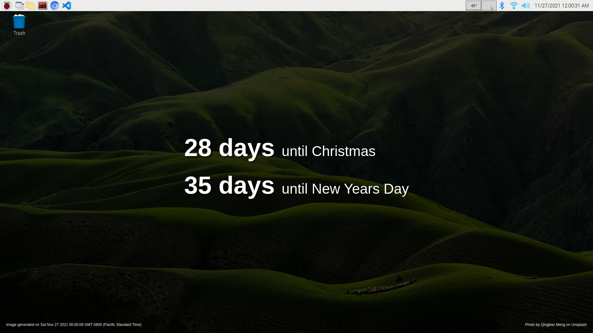

# Raspberry Pi Desktop Countdown Background Generator



This Raspberry Pi OS project automatically generates and updates a background image that displays the number of days remaining until a list of events occur. I built this project [during the pandemic](https://twitter.com/tylerlwsmith/status/1382978880768647171) to track how many days I had left until I received my second vaccination and when I would be considered fully vaccinated. The project enables you to [configure your own countdown events](#configuring-your-own-countdown-events).

This project uses Docker Compose to build a Node.js container that runs Puppeteer, Express.js, EJS and Luxon to generate the images. Scheduling for the image generation is done on the host Pi using `crontab`. The Node script makes heavy use of async/await with few abstractions to allow the script to be as linear as possible.

## Prerequisites

Before you can run this project, you need the following:

- **A Raspberry Pi running Raspberry Pi OS with the default LXDE desktop environment enabled.** This was developed and tested on Raspberry Pi OS Buster, and it's possible that this project might work on other LXDE-based desktops. However, it has not yet been tested with the Bullseye release of Raspberry Pi OS, which includes [major changes](https://www.raspberrypi.com/news/raspberry-pi-os-debian-bullseye/) to the operating system.
- **Docker and Docker Compose installed locally.** You can find installation instructions for Docker [here](https://docs.docker.com/engine/install/debian/), and installation instructions for Docker Compose [here](https://docs.docker.com/compose/install/). For Docker Compose, follow along with the "Install using pip" instructions under the "Alternative install options" tab. The standard Linux installation method for Compose doesn't work at the time of writing because Docker doesn't distribute an ARM version.
- **A user who has been added to the Docker group.** You can add a user to the `docker` group by running `sudo usermod -aG docker $USER` in the shell of the user you'd like to apply the `docker` group to. After running this command, **log out and log in again for the change to take effect**. This step is important: if a user isn't a part of the `docker` group, they won't be able to run Docker in a cron job.
- **Your local timezone configured on your Pi.** The project depends on your Pi's timezone being accurate to ensure that the number of days remaining is correct when the cron runs at midnight.

## Installing locally

To make installing this project as painless as possible, a script for setting up a local environment has been provided. The script will do the following:

- Build the Docker image
- Create a container from the Docker image
- Copy the container's `node_modules` folder to the host, replacing the host's `node_modules` folder if it exists
- Copy the `background-generator/events/events.example.js` file to `events.js` in the same directory
- Print the instructions for installing the project as a cron job

To run the setup script, clone the project to your Pi, then run the following command in a shell from the main project directory:

```sh
./bin/setup-local-environment
```

**After running the script, be sure to follow along with the cron setup instructions that the script outputs.** Its output will be similar to the following:

```sh
# NOTE: This isn't the real output! Please reference the instructions that are
#       printed at the end of the ./bin/setup-local-environment script.

Run 'crontab -e' in a shell, then copy and save the following to the cron file:

@reboot   /home/pi/pi-background-generator/bin/run >> /home/pi/pi-background-generator/logs/cron.log 2>&1
0 0 * * * /home/pi/pi-background-generator/bin/run >> /home/pi/pi-background-generator/logs/cron.log 2>&1
```

## Configuring your own countdown events

After running the `./bin/setup-local-environment` script, you will find an events file at `background-generator/events/events.js`. You can modify, add or remove events in this file. The file is excluded from version control, so edits won't get committed to the repo.

Below is the default events array in `events.js`. You may add as many or as few events to this array as you like, so long as the array consists of object literals with a `date` (formatted `yyyy-mm-dd`) and `description` property.

```js
module.exports = [
  {
    date: "2030-04-02",
    description: "I have a midlife crisis",
  },
  {
    date: "2044-01-03",
    description: "I'm qualified for a senior discount",
  },
];
```

## Generating a background after configuring events

The first time that you run the background generation, you probably won't want to reboot your Pi or wait until the cron runs at midnight to see the new background. To generate a new background immediately, run the following command from the project's main directory:

```sh
./bin/run
```

## Troubleshooting

If you can't execute `./bin/setup-local-environment` or `./bin/run`, make sure that these scripts are set as executable by running `chmod +x bin/*` from the project's main directory.

If the cron is not working as expected, check the log file at `logs/cron.log` in the main project directory.

On rare occasions, the script may become stuck and unable to generate a background image. In these instances, the script will exit after about 60 seconds to prevent the container from running in the background indefinitely. Restarting the computer should cause the background to regenerate, or you can manually trigger an update by running `./bin/run` in a shell from the project's main directory.

## Manually testing cron job

When developing, you may want to run the cron once-a-minute for frequent feedback. You can do that by running `crontab -e` and changing the project entry that starts with `0 0 * * *` to `* * * * *`. To view the output of the cron, go to `logs/cron.log` in your project directory.

One of the trickier aspects of testing this project is ensuring that the crons fire at the correct times with the expected output. To test this, you may need to manually override the date settings on your Pi.

To override the time on your Pi, start by disabling Network Time Protocol (NTP) synchronization:

```sh
sudo timedatectl set-ntp false
```

You can confirm that the NTP service is inactive by running `timedatectl` and checking that `NTP service` is set to `inactive`.

Next, set the current desired time:

```
sudo timedatectl set-time "2021-11-26 23:58:50"
```

When you're done testing the cron, re-enable the NTP synchronization so the Pi will reset itself to the correct time. If your Pi doesn't have an Internet connection, you'll need to reset the time manually before re-enabling NTP.

```sh
sudo timedatectl set-ntp true
```

## Why use Docker?

I had originally built this project using Node Version Manager (NVM) and the Raspberry Pi OS's supplied Chromium installation. However, this setup was tightly coupled to both NVM and the host Chromium installation, which caused issues with portability to other Pis. NVM requires certain environment variables to be set in order for Node.js to work, and other Node installation methods may require their own environment variables to work. The script would also break if the user uninstalled Chromium in favor of Firefox.

With so many ways to install Node and no guarantee of a Chromium installation, it seemed best to side-step the problems entirely by using a container. Leveraging Docker means this project can make far fewer assumptions about the state of the host operating system.

## Background image

The background image that is included with this project was taken by [Qingbao Meng](https://unsplash.com/@ideasboom?utm_source=unsplash&utm_medium=referral&utm_content=creditCopyText) and can be found at [Unsplash](https://unsplash.com/photos/01_igFr7hd4).
